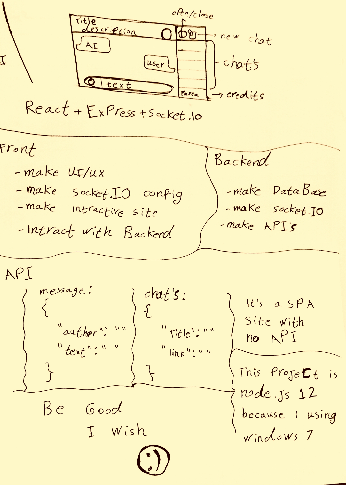

<div align="center">
  
</div>

<br>

<div align="center">

# 🤖 Chat-Bot | A Real-Time Chat Bot with RiveScript

[](https://opensource.org/licenses/MIT)
[](https://nodejs.org/)
[](https://expressjs.com/)
[](https://socket.io/)

**An intelligent real-time chatbot built with RiveScript, React, Express, and Socket.io**

[Report Issue](https://github.com/ParsaXpython/Chat-Bot/issues) • [Submit Pull Request](https://github.com/ParsaXpython/Chat-Bot/pulls)

</div>

---

## 📝 About The Project

This project is a **Real-Time Chat Bot** built using **RiveScript**. RiveScript is a simple programming language designed for creating AI-based applications. You can easily add new responses to make the chatbot smarter and more interactive.

### ✨ Features

- **💬 Intelligent Responses**: Powered by RiveScript with the ability to learn and add new responses
- **⚡ Real-Time Communication**: Built with Socket.io, no page refresh required
- **🎨 Modern UI**: Built with React.js
- **🖥️ Powerful Server**: Powered by Express.js
- **📦 Lightweight**: Small footprint with optimized performance

---

## 🛠️ Built With

<p align="center">
  <a href="https://reactjs.org/">
    
  </a>
  <a href="https://expressjs.com/">
    
  </a>
  <a href="https://socket.io/">
    
  </a>
  <a href="https://nodejs.org/">
    
  </a>
  <a href="https://www.rivescript.com/">
    
  </a>
</p>

---

## 🚀 Getting Started

Follow these steps to get the project running on your local machine.

### Prerequisites

- Node.js (version 12.22.12 or higher)
- npm (usually installed with Node.js)
- OS: Windows, Linux, or macOS

### Installation

1.  **Clone the repository**
    ```bash
    git clone https://github.com/ParsaXpython/Chat-Bot.git
    cd Chat-Bot
    ```
2. **Install dependencies**
    ```bash
    npm install
    ```
3. **Run in development mode**
    ```bash
    npm start
    ```
The application will be available at `http://localhost:3000`<br/>
4. **Run in production mode** <br>
    ```bash
    npm run build
    node app.js
    ```
# 📂 Project Structure
```text
Chat-Bot/
│                 
├── src/                    # Client-side code (React)
│   ├── components/         # React components
|   └── public              # Static Files
├── brain                   # RiveScript knowledge files
├── snapshots/              # Project images
├── .gitignore
├── app.js                  # Main server file (Express)
├── package.json
└── README.md
```
>Note: The exact structure may evolve as the project grows.

# 🤝 Contributing

Contributions are welcome! Please follow these steps:

1. Fork the repository
2. Create a new branch (`git checkout -b feature/AmazingFeature`)
3. Commit your changes (`git commit -m 'Add some AmazingFeature'`)
4. Push to the branch (`git push origin feature/AmazingFeature`)
5. Open a Pull Request

## Ideas for contributions:
* ✨ Add new responses to RiveScript knowledge base
* 🎨 Improve UI/UX design
* 🌐 Add multi-language support
* 📱 Optimize for mobile devices

# 📜 License
This project is licensed under the MIT License. See the `LICENSE` file for more information.

# 👤 Author
**ParsaXpython**
* GitHub: [@ParsaXpython](https://github.cmo/ParsaXpython/)
<div align="center"> <sub>Built with ❤️ by <a href="https://github.com/ParsaXpython">ParsaXpython</a></sub> </div>